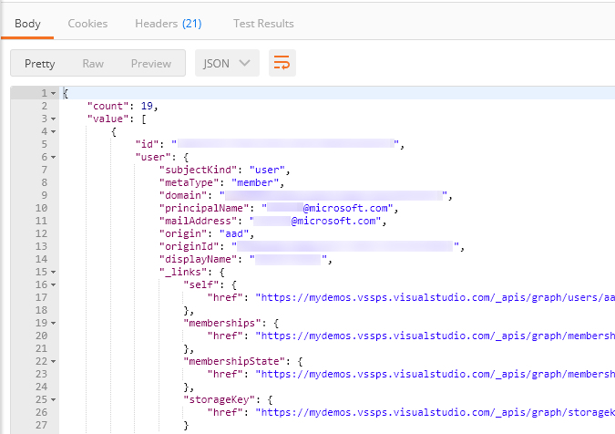

# Contributing to VSTeam

I am truly grateful for all the support developing VSTeam. It means a lot that you spend your time to help improve this module.

## Steps to contribute
1. Visit [docs.microsoft.com](http://cda.ms/4j) and find the API you want to wrap. 
2. Explore the API and get familiar with it.
3.	Fork this repository and create a branch for your work. 
4.	Write help. **It is important that you do this before you start adding the function.**
5.	Write unit tests.
6.	Code the function.
7.	Add type file.
8.	Add format file.
9. Update the psd1 file.
10. Update the Readme.md file.
11. Goto 4 for next function.

### Housekeeping

This module runs on Mac, PC and Linux. Therefore, casing is very important.  When you update the psd1 file the casing of the files must match those on disk. If they do not there could be issue loading the module on Mac and Linux.

### Explore the API

To access the REST API, you are going to need a Personal Access Token (PAT). You can learn how to create a PAT from the [Authenticating with personal access tokens](http://cda.ms/4k) topic of [docs.microsoft.com](http://cda.ms/4k). Once you have a PAT start Postman. If you do not have Postman you can download it from getPostman.com.

I normally begin with Get-xxx function of any API. For the purpose of this document I am going to use the [User Entitlements API](http://cda.ms/4m). This function will combine the Get and List APIs.  I will begin with List. Using the sample request enter the data into Postman. 

GET https://{accountName}.vsaex.visualstudio.com/_apis/userentitlements?top={top}&skip={skip}&api-version=4.1-preview

Replace {accountName} with just the portion of your Visual Studio Team Services (VSTS) URL before “.visualstudio.com.” For {top} I am going to enter 100 and for {skip} 0. Postman should look similar to the image below.

Now before we press Send we have to enter our PAT. Select “Basic Auth” for Type under Authorization. You can leave the Username empty. For your Password copy and paste in your PAT.

Now you can press Send. Postman will issue the request and display the results at the bottom of the user interface.

This confirms that we know how to build a complete request to the service. This is an opportunity to explore all the parameters of the API and make sure you know what to expect.

### Get the code

Now it is time to get your hands on VSTeam. Fork this repository, clone it to your development machine and create a branch for your work.

### Write Help

Every new function must have help that explains how to use it. The help can be authored using Markdown in the .docs folder. The help is generated using a combination of [platyPS](https://github.com/PowerShell/platyPS) and [markdown-include](https://github.com/sethen/markdown-include). platyPS enables the authoring of External Help with Markdown.  When creating help for a PowerShell module you will find yourself writing a lot of the same Markdown multiple times. markdown-include enables reuse of the Markdown by allowing you to include markdown files into other markdown files using a C style include syntax.

I have found writing the help before I start to write the function saves me a lot of time. This forces me to think of all the use cases of the function and which parameters I plan to support. It also allows me to get the boring part out of the way so I end on a high note writing the code. 

You can run gen-help.ps1 from the .docs folder to make sure you can generate the help file.

### Write Unit Test

Using [Pester](https://github.com/pester/Pester) write unit test for the new function. I am a firm believer if I cannot write a test before I write the code I am not clear on what I expect the code to do. After writing the help first writing the unit tests should be pretty straight forward. 

At first it will feel odd to write the help and test first but the more you do it the easier it gets. 

Because I will not be over your shoulder you could write the tests and even the help after. **Just know if your pull request does not have tests and help it will be rejected.**

### Code the function

By now there should be a module that has already wrapped an API similar to the one you are wrapping now. Use that code as template for your module. Consistency is very important to me and will slow the pull request process if the changes are not consistent with those already in the module. 

If you feel the conventions should be changed please log and issue so we can discuss.

### Add a type file

Type files go in the types folder.

### Add a format file

Format files go in the formats folder.

### Update VSTeam.psd1

Make sure casing of all the files you add match. This module runs on Mac, PC and Linux and casing is very important.

### Update README.md

Update the Release Notes section of the readme file with your changes. 